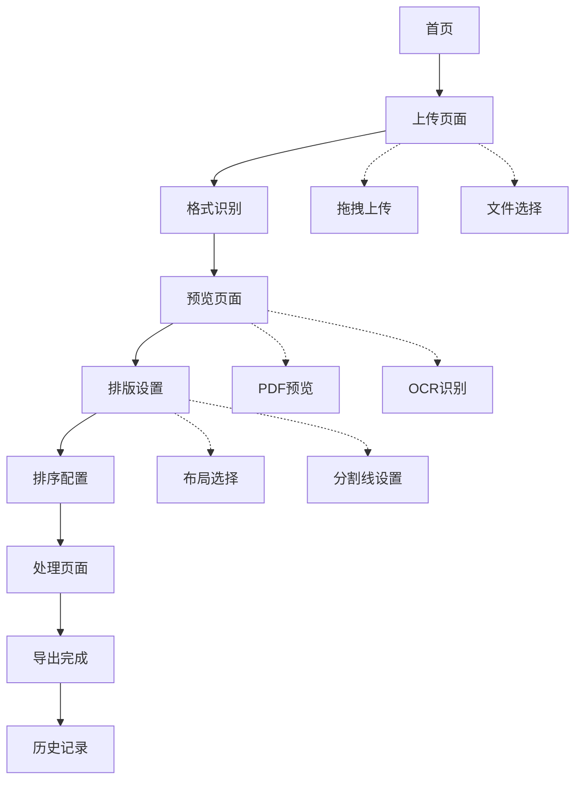

## 1. 产品概述
专业的PDF合并与排版工具，旨在解决财务、行政等场景中多页发票、车票等单据的批量处理和智能排版需求。通过OCR识别、智能排序和灵活排版，大幅提升文档处理效率，节省纸张和打印成本。

目标用户：财务人员、行政助理、会计、需要处理大量单据的企业和个人用户。

## 2. 核心功能

### 2.1 用户角色
| 角色 | 注册方式 | 核心权限 |
|------|----------|----------|
| 普通用户 | 邮箱注册/游客模式 | 基础PDF处理、单次最多10个文件 |
| 高级用户 | 付费升级 | 无限制文件处理、OCR高级功能、批量导出 |

### 2.2 功能模块
PDF合并排版工具包含以下核心页面：
1. **上传页面**：拖拽上传、文件选择、格式识别、上传进度显示
2. **预览页面**：PDF预览、页面缩略图、内容识别结果展示
3. **排版设置页面**：布局选择、页面设置、分割线配置、排序选项
4. **处理页面**：实时进度、处理状态、预览效果、导出功能
5. **历史记录页面**：处理历史、文件管理、重新处理

### 2.3 页面详情
| 页面名称 | 模块名称 | 功能描述 |
|----------|----------|----------|
| 上传页面 | 文件上传区域 | 支持拖拽上传和点击选择，批量处理多个PDF文件，显示上传进度和状态 |
| 上传页面 | 格式识别模块 | 自动识别发票/火车票格式，提供手动格式选择和确认功能 |
| 上传页面 | 文件列表管理 | 显示已上传文件列表，支持删除、重新排序、查看详情 |
| 预览页面 | PDF预览器 | 集成PDF.js显示PDF内容，支持页面缩放、翻页、旋转 |
| 预览页面 | 缩略图导航 | 显示所有页面缩略图，支持快速跳转和页面选择 |
| 预览页面 | OCR识别结果 | 展示识别的关键字段（日期、金额、编号），支持手动修正 |
| 排版设置页面 | 布局配置器 | 提供1×1、2×2、3×3等布局选项，实时预览排版效果 |
| 排版设置页面 | 页面设置模块 | 选择页面方向（横向/纵向），设置页边距和缩放比例 |
| 排版设置页面 | 分割线系统 | 配置分割线样式（十字形/网格线）、颜色、粗细，支持自定义 |
| 排版设置页面 | 排序选项 | 按时间、金额、编号排序，支持升序/降序和自定义排序规则 |
| 处理页面 | 实时进度显示 | 显示当前处理进度、预估剩余时间，支持取消操作 |
| 处理页面 | 效果预览 | 实时显示处理后的PDF预览，支持放大缩小查看细节 |
| 处理页面 | 导出功能 | 一键导出最终PDF，支持选择保存位置和文件名 |
| 历史记录页面 | 处理历史列表 | 显示历史处理记录，包含时间、文件数量、处理结果 |
| 历史记录页面 | 文件管理 | 支持重新下载、删除记录、查看处理详情 |

## 3. 核心流程

### 普通用户流程
1. 访问首页，选择上传PDF文件（支持拖拽和点击选择）
2. 系统自动识别文档格式，用户确认或手动调整
3. 进入预览页面，查看PDF内容和OCR识别结果
4. 配置排版参数：选择布局、页面方向、分割线样式
5. 设置排序规则：按时间、金额或编号排序
6. 开始处理，实时查看进度和预览效果
7. 处理完成后，导出最终PDF文件
8. 可在历史记录中查看和管理处理过的文件

### 高级用户流程
在普通用户基础上，享有无限制文件处理、高级OCR功能、批量导出等特权。

## 4. 用户界面设计

### 4.1 设计风格
- **主色调**：专业蓝色(#2563eb)搭配白色背景，营造专业可信的视觉感受
- **辅助色**：灰色系(#6b7280, #9ca3af)用于次要信息和边框
- **强调色**：绿色(#10b981)用于成功状态，橙色(#f59e0b)用于警告
- **按钮样式**：圆角矩形设计，主要操作为实心填充，次要操作为边框样式
- **字体选择**：系统默认字体，标题16-18px，正文14px，小字12px
- **布局风格**：卡片式布局，清晰的模块分区，合理的留白和间距
- **图标风格**：使用简洁的线性图标，保持视觉一致性

### 4.2 页面设计概览
| 页面名称 | 模块名称 | UI元素 |
|----------|----------|--------|
| 上传页面 | 文件上传区域 | 大尺寸的虚线框拖拽区域，中央显示上传图标和文字提示，支持多文件同时上传 |
| 上传页面 | 格式识别模块 | 卡片式展示识别的格式类型，提供单选按钮供用户确认或修改 |
| 上传页面 | 文件列表 | 表格形式展示文件名、大小、页数，每行提供删除和查看按钮 |
| 预览页面 | PDF预览器 | 占据页面主要区域，顶部工具栏包含缩放、翻页、旋转控件 |
| 预览页面 | 缩略图侧边栏 | 左侧垂直排列缩略图，当前选中页面高亮显示 |
| 预览页面 | OCR结果面板 | 右侧展示识别的关键信息，可编辑的文本框形式 |
| 排版设置页面 | 布局选择器 | 图形化展示不同布局选项，点击选择后高亮显示 |
| 排版设置页面 | 页面设置面板 | 表单形式收集页面方向、边距、缩放等参数设置 |
| 排版设置页面 | 分割线预览 | 实时显示分割线效果，提供样式、颜色、粗细调节滑块 |
| 处理页面 | 进度条 | 顶部显示处理进度百分比和预估时间，支持取消操作 |
| 处理页面 | 预览区域 | 中央显示处理后的PDF预览，支持缩放和翻页查看 |
| 处理页面 | 导出按钮 | 醒目的导出按钮，支持选择保存位置和文件名 |

### 4.3 响应式设计
- **桌面端优先**：针对1920×1080分辨率优化设计，充分利用大屏幕空间
- **平板适配**：1024px以上宽度保持完整功能，调整布局为更紧凑的形式
- **移动端支持**：768px以下宽度采用垂直堆叠布局，隐藏非核心功能
- **触控优化**：按钮和交互元素适配触控操作，增大点击区域
- **加载优化**：根据设备性能调整预览质量和处理速度