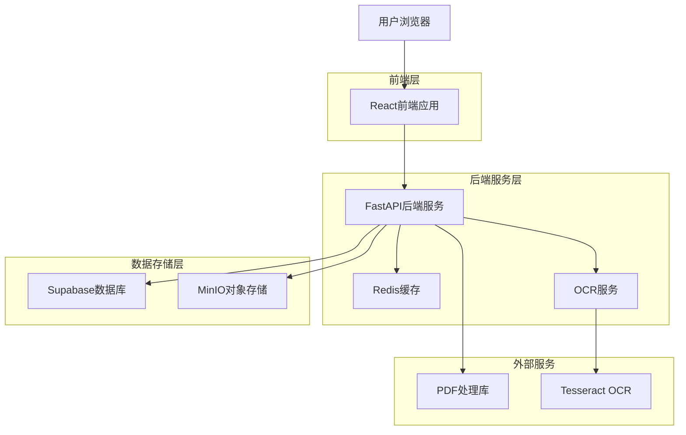
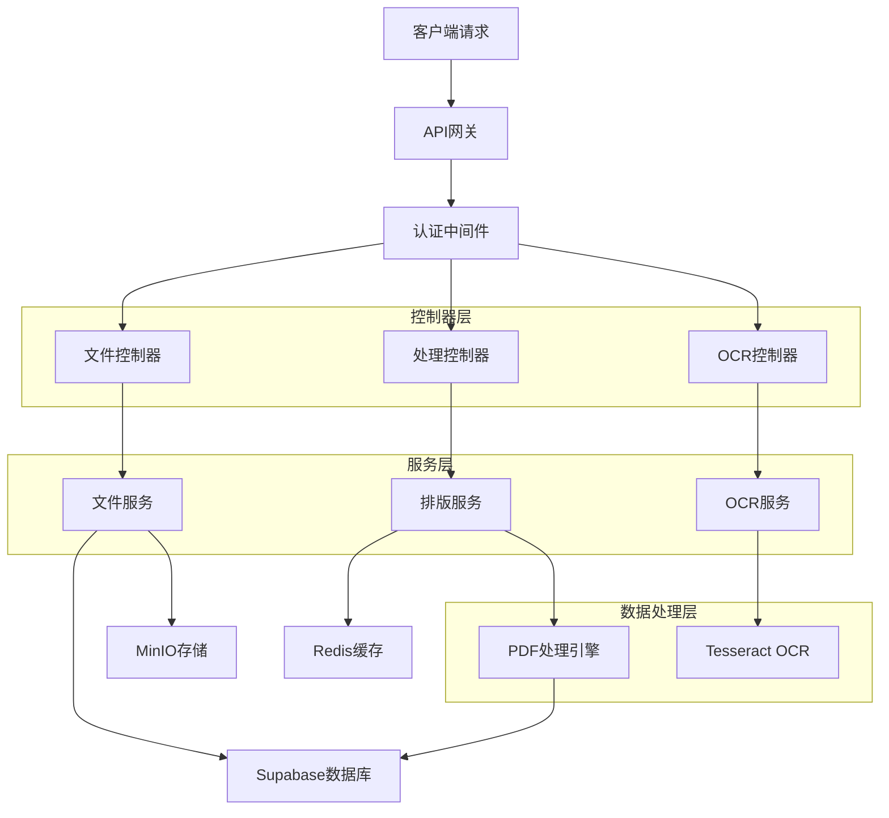
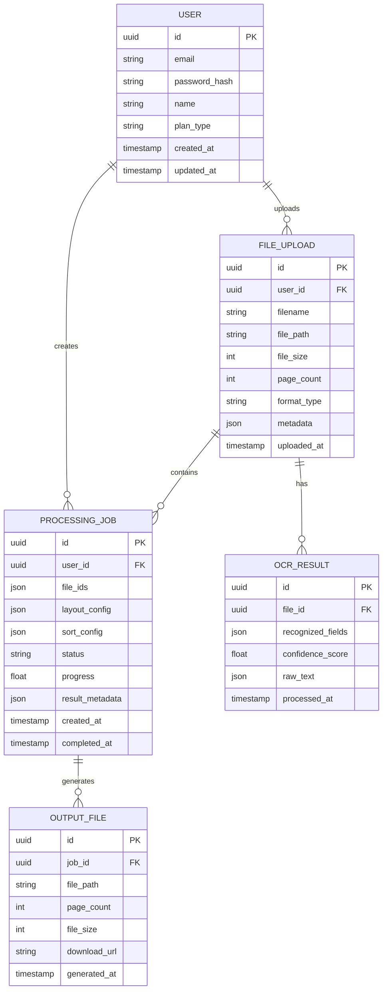

## 1. 架构设计



## 2. 技术描述

- **前端**: React@18 + TypeScript + Tailwind CSS + Vite
- **初始化工具**: vite-init
- **后端**: FastAPI@0.104 + Python@3.11
- **数据库**: Supabase (PostgreSQL@15)
- **缓存**: Redis@7
- **对象存储**: MinIO
- **PDF处理**: PyPDF2@3.0 + pdfplumber@0.9
- **OCR识别**: Tesseract OCR@5.0 + pytesseract@0.3
- **图像处理**: Pillow@10.0 + OpenCV@4.8
- **PDF生成**: ReportLab@4.0

## 3. 路由定义

| 路由 | 用途 |
|-------|---------|
| / | 首页，产品介绍和功能入口 |
| /upload | 文件上传页面，支持拖拽和选择 |
| /preview | PDF预览和OCR识别结果展示 |
| /layout | 排版设置和参数配置 |
| /process | 处理进度和效果预览 |
| /history | 历史记录和文件管理 |
| /login | 用户登录页面 |
| /register | 用户注册页面 |
| /profile | 用户个人中心和设置 |

## 4. API定义

### 4.1 文件上传API

**上传PDF文件**
```
POST /api/files/upload
```

请求参数（multipart/form-data）：
| 参数名 | 类型 | 必需 | 描述 |
|-----------|-------------|-------------|-------------|
| files | File[] | 是 | PDF文件数组 |
| user_id | string | 否 | 用户ID（可选） |

响应：
```json
{
  "status": "success",
  "data": {
    "uploaded_files": [
      {
        "file_id": "uuid",
        "filename": "invoice_001.pdf",
        "size": 1024000,
        "pages": 1,
        "format_type": "invoice",
        "upload_time": "2024-01-01T12:00:00Z"
      }
    ]
  }
}
```

### 4.2 OCR识别API

**执行OCR识别**
```
POST /api/ocr/recognize
```

请求体：
```json
{
  "file_id": "uuid",
  "recognize_fields": ["date", "amount", "number"]
}
```

响应：
```json
{
  "status": "success",
  "data": {
    "recognized_fields": {
      "date": "2024-01-01",
      "amount": "￥1,234.56",
      "number": "INV-2024001"
    },
    "confidence": 0.95,
    "processing_time": 2.5
  }
}
```

### 4.3 排版处理API

**生成排版配置**
```
POST /api/layout/generate
```

请求体：
```json
{
  "file_ids": ["uuid1", "uuid2"],
  "layout_config": {
    "layout_type": "2x2",
    "page_orientation": "portrait",
    "margin": 10,
    "scale": 0.9,
    "divider_style": {
      "type": "cross",
      "color": "#000000",
      "thickness": 1
    }
  },
  "sort_config": {
    "sort_by": "date",
    "sort_order": "asc"
  }
}
```

响应：
```json
{
  "status": "success",
  "data": {
    "job_id": "uuid",
    "preview_url": "/api/preview/uuid",
    "estimated_time": 30,
    "output_pages": 5
  }
}
```

### 4.4 处理进度API

**获取处理进度**
```
GET /api/process/status/{job_id}
```

响应：
```json
{
  "status": "processing",
  "data": {
    "progress": 65,
    "current_stage": "applying_layout",
    "estimated_remaining": 10,
    "preview_available": true
  }
}
```

### 4.5 文件导出API

**导出处理后的PDF**
```
GET /api/files/export/{job_id}
```

响应：
- 返回处理后的PDF文件流
- Content-Type: application/pdf

## 5. 服务器架构图



## 6. 数据模型

### 6.1 数据模型定义



### 6.2 数据定义语言

**用户表 (users)**
```sql
-- 创建用户表
CREATE TABLE users (
    id UUID PRIMARY KEY DEFAULT gen_random_uuid(),
    email VARCHAR(255) UNIQUE NOT NULL,
    password_hash VARCHAR(255) NOT NULL,
    name VARCHAR(100) NOT NULL,
    plan_type VARCHAR(20) DEFAULT 'free' CHECK (plan_type IN ('free', 'premium', 'enterprise')),
    usage_count INTEGER DEFAULT 0,
    created_at TIMESTAMP WITH TIME ZONE DEFAULT NOW(),
    updated_at TIMESTAMP WITH TIME ZONE DEFAULT NOW()
);

-- 创建索引
CREATE INDEX idx_users_email ON users(email);
CREATE INDEX idx_users_plan_type ON users(plan_type);

-- 初始化数据
INSERT INTO users (email, password_hash, name, plan_type) 
VALUES ('demo@example.com', 'hashed_password', 'Demo User', 'free');
```

**文件上传表 (file_uploads)**
```sql
-- 创建文件上传表
CREATE TABLE file_uploads (
    id UUID PRIMARY KEY DEFAULT gen_random_uuid(),
    user_id UUID REFERENCES users(id) ON DELETE CASCADE,
    filename VARCHAR(255) NOT NULL,
    file_path VARCHAR(500) NOT NULL,
    file_size INTEGER NOT NULL,
    page_count INTEGER NOT NULL DEFAULT 1,
    format_type VARCHAR(50) CHECK (format_type IN ('invoice', 'ticket', 'receipt', 'other')),
    metadata JSONB DEFAULT '{}',
    uploaded_at TIMESTAMP WITH TIME ZONE DEFAULT NOW()
);

-- 创建索引
CREATE INDEX idx_file_uploads_user_id ON file_uploads(user_id);
CREATE INDEX idx_file_uploads_uploaded_at ON file_uploads(uploaded_at DESC);
CREATE INDEX idx_file_uploads_format_type ON file_uploads(format_type);

-- 授权访问
GRANT SELECT ON file_uploads TO anon;
GRANT ALL PRIVILEGES ON file_uploads TO authenticated;
```

**OCR结果表 (ocr_results)**
```sql
-- 创建OCR结果表
CREATE TABLE ocr_results (
    id UUID PRIMARY KEY DEFAULT gen_random_uuid(),
    file_id UUID REFERENCES file_uploads(id) ON DELETE CASCADE,
    recognized_fields JSONB NOT NULL,
    confidence_score FLOAT CHECK (confidence_score >= 0 AND confidence_score <= 1),
    raw_text TEXT,
    processed_at TIMESTAMP WITH TIME ZONE DEFAULT NOW()
);

-- 创建索引
CREATE INDEX idx_ocr_results_file_id ON ocr_results(file_id);
CREATE INDEX idx_ocr_results_confidence ON ocr_results(confidence_score DESC);

-- 授权访问
GRANT SELECT ON ocr_results TO anon;
GRANT ALL PRIVILEGES ON ocr_results TO authenticated;
```

**处理任务表 (processing_jobs)**
```sql
-- 创建处理任务表
CREATE TABLE processing_jobs (
    id UUID PRIMARY KEY DEFAULT gen_random_uuid(),
    user_id UUID REFERENCES users(id) ON DELETE CASCADE,
    file_ids JSONB NOT NULL,
    layout_config JSONB NOT NULL,
    sort_config JSONB,
    status VARCHAR(20) DEFAULT 'pending' CHECK (status IN ('pending', 'processing', 'completed', 'failed')),
    progress FLOAT DEFAULT 0 CHECK (progress >= 0 AND progress <= 100),
    result_metadata JSONB DEFAULT '{}',
    created_at TIMESTAMP WITH TIME ZONE DEFAULT NOW(),
    completed_at TIMESTAMP WITH TIME ZONE
);

-- 创建索引
CREATE INDEX idx_processing_jobs_user_id ON processing_jobs(user_id);
CREATE INDEX idx_processing_jobs_status ON processing_jobs(status);
CREATE INDEX idx_processing_jobs_created_at ON processing_jobs(created_at DESC);

-- 授权访问
GRANT SELECT ON processing_jobs TO anon;
GRANT ALL PRIVILEGES ON processing_jobs TO authenticated;
```

**输出文件表 (output_files)**
```sql
-- 创建输出文件表
CREATE TABLE output_files (
    id UUID PRIMARY KEY DEFAULT gen_random_uuid(),
    job_id UUID REFERENCES processing_jobs(id) ON DELETE CASCADE,
    file_path VARCHAR(500) NOT NULL,
    page_count INTEGER NOT NULL,
    file_size INTEGER NOT NULL,
    download_url VARCHAR(500),
    generated_at TIMESTAMP WITH TIME ZONE DEFAULT NOW()
);

-- 创建索引
CREATE INDEX idx_output_files_job_id ON output_files(job_id);
CREATE INDEX idx_output_files_generated_at ON output_files(generated_at DESC);

-- 授权访问
GRANT SELECT ON output_files TO anon;
GRANT ALL PRIVILEGES ON output_files TO authenticated;
```

## 7. 性能优化策略

### 7.1 处理性能优化
- **异步处理**：使用Celery进行后台任务处理，避免阻塞主线程
- **批量处理**：一次处理多个页面，减少I/O操作次数
- **内存管理**：采用流式处理，控制内存使用在500MB以内
- **缓存机制**：Redis缓存OCR结果和常用排版配置

### 7.2 存储优化
- **文件压缩**：上传时自动压缩PDF文件，减少存储和传输开销
- **分片存储**：大文件采用分片上传和存储策略
- **CDN加速**：静态资源使用CDN分发，提升访问速度

### 7.3 数据库优化
- **索引优化**：为常用查询字段建立复合索引
- **分区策略**：按时间分区存储历史数据
- **连接池**：使用连接池管理数据库连接

## 8. 安全考虑

### 8.1 文件安全
- **文件类型验证**：严格验证上传文件类型，只允许PDF格式
- **病毒扫描**：集成杀毒引擎扫描上传文件
- **访问控制**：基于用户权限控制文件访问

### 8.2 数据安全
- **数据加密**：敏感数据采用AES-256加密存储
- **传输加密**：全站HTTPS加密传输
- **备份策略**：定期备份重要数据到异地存储

### 8.3 隐私保护
- **OCR数据处理**：识别完成后可选择删除原始图片数据
- **访问日志**：记录用户操作日志，支持审计追踪
- **GDPR合规**：符合数据保护法规要求